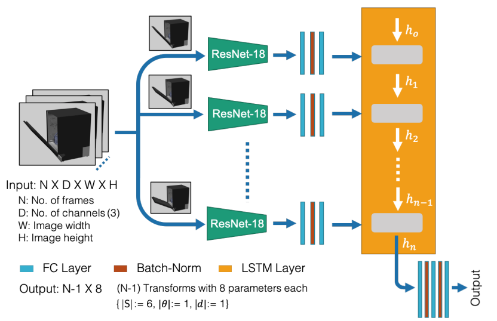
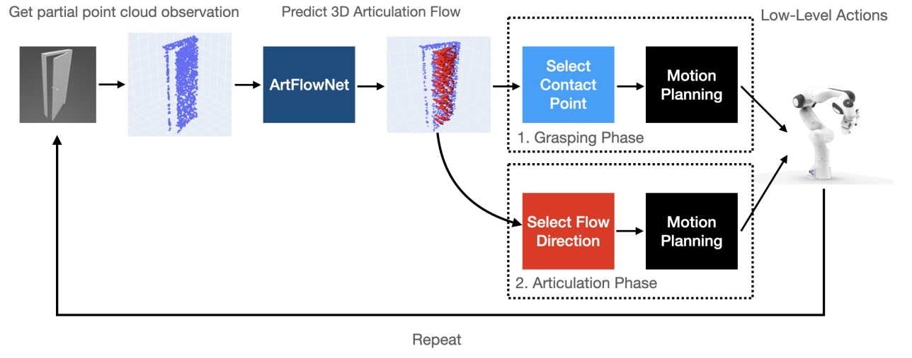
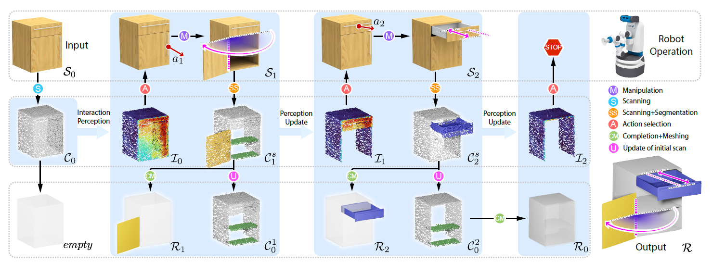

# Awesome-Articulation-Reconstruction-Works

This is a repo that collects some works about **articulated object reconstruction**. Articulation reconstruction is about reconstructing interactive objects from observation gathered from interaction with the object. I will also write blog posts for some works that contains outstanding approaches. Please post an issue if there are more papers or projects that you recommend. 

**Keywords:** Digital twins, Articulation reconstruction, part-level reconstruction, Interactive Perception

## Reconstruction

[Ditto: Building digital twins of articulated objects from interaction](https://arxiv.org/abs/2202.08227). CVPR 2022.

- [[Github](https://github.com/UT-Austin-RPL/Ditto)] [[Project](https://ut-austin-rpl.github.io/Ditto/)]
- This paper propose a pre-trained model to reconstruct articulated physical objects. based on the point cloud of the object before and after interaction based on point segmentation. It can divide object into 1 static part 1 moving part, and a revolute or prismatic joint. However, it is limited in generalization to unseen object categories and it does not address detailed appearance reconstruction.
- Blog post TBD.

[Ditto in the house: Building articulation models of indoor scenes through interactive perception](https://arxiv.org/abs/2302.01295). ICRA 2023. 

- [[Github](https://github.com/UT-Austin-RPL/HouseDitto)] [[Project](https://ut-austin-rpl.github.io/HouseDitto/)]
- This paper proposed an approach to reconstruct articulated objects based on interactive perception. It takes observation as input and performs affordance prediction to choose an interaction point. Then by performing the interaction the articulation inference gets the observation before and after interaction, which are used to form the articulation model along with contact region. However there are no planning module for embodied AI in this paper, agents are teleported to the interaction point.
- Blog post TBD.

[PARIS: Part-level Reconstruction and Motion Analysis for Articulated Objects](https://arxiv.org/abs/2308.07391) ICCV 2023.

- [[Github](https://github.com/3dlg-hcvc/paris)] [[Project](https://3dlg-hcvc.github.io/paris/)] [[Video](https://www.youtube.com/watch?v=tDSrROPCgUc)]
- This paper introduces a self-supervised, end-to-end architecture that learns part-level implicit shape and appearance models and optimizes motion parameters jointly without requiring any 3D supervision, motion, or semantic annotation. The training process is similar to original NeRF but and extend the ray marching and volumetric rendering procedure to compose the two fields.
- Blog post TBD.

[ScrewNet: Category-Independent Articulation Model Estimation From Depth Images Using Screw Theory](https://arxiv.org/abs/2008.10518) ICRA 2021.

- [[Github](https://github.com/Pearl-UTexas/ScrewNet)] [[Project](https://pearl-utexas.github.io/ScrewNet/)]
- This paper proposed a method to predict articulation model based on a sequence of depth images. The paper uses screw theory to unify the  the representation of different articulation types. No segmentation of static and dynamic part is included in this method.

[FlowBot3D: Learning 3D Articulation Flow to Manipulate Articulated Objects](https://arxiv.org/pdf/2205.04382.pdf)  RSS 2022

- [[Github](https://github.com/r-pad/flowbot3d)] [[Project Page](https://sites.google.com/view/articulated-flowbot-3d/home)] 
- This paper proposes a 3D Articulation Flow to model the articulation property of objects and guides robot manipulation. It proposes a network to predict the flow based on point cloud input and guides the manipulation of robot.

## Interactive Perception

Interaction-Driven Active 3D Reconstruction with Object Interiors  SIGGRAPH 2023

- [[Github(Coming soon)](https://github.com/Salingo/Interaction-Driven-Reconstruction)] [[Project Page](https://vcc.tech/research/2023/InterRecon)]
- This paper proposed a method automate the interactive process and segment multiple dynamic parts with multi-round interaction. By encoding the input registered point clouds of the object, it generates the planned motion based on where2act and reconstruct the links. The point clouds before and after interaction are labeled and concatenated to encode as pointwise features by PointNeXT and concatenated  with motion parameter, a residual MLP is used to generate the mask of segmentation. After segmentation, the point cloud is completed by [SeedFormer](https://arxiv.org/abs/2207.10315) and use pre-trained [neural dual contouring (NDC)](https://arxiv.org/abs/2202.01999) to mesh. 
- Blog post TBD.

[Neural Field Representations of Articulated Objects for Robotic Manipulation Planning](https://arxiv.org/pdf/2309.07620.pdf)

- [Github] [[Project](https://phgrote.github.io/nfr)] [[Video](https://phgrote.github.io/nfr/#Video)]
- `TBD`

## TBD

Articulated Object Neural Radiance Field [[Github](https://github.com/zubair-irshad/articulated-object-nerf)]

[Occlusion-aware reconstruction and manipulation of 3D articulated objects](https://ieeexplore.ieee.org/document/6224911) ICRA 2012.

[Shape2Motion: Joint Analysis of Motion Parts and Attributes from 3D Shapes](https://arxiv.org/pdf/1903.03911.pdf) CVPR 2019

[Part-level Scene Reconstruction Affords Robot Interaction](https://arxiv.org/pdf/2307.16420) CoRR 2023

~~https://arxiv.org/abs/2104.07645~~

https://github.com/daerduoCarey/where2act ICCV 2021

[Target-driven Visual Navigation in Indoor Scenes using Deep Reinforcement Learning](https://arxiv.org/abs/1609.0514) ICRA 2017

[NARF22: Neural Articulated Radiance Fields for Configuration-Aware Rendering](https://arxiv.org/pdf/2210.01166.pdf)

https://nvlabs.github.io/watch-it-move/