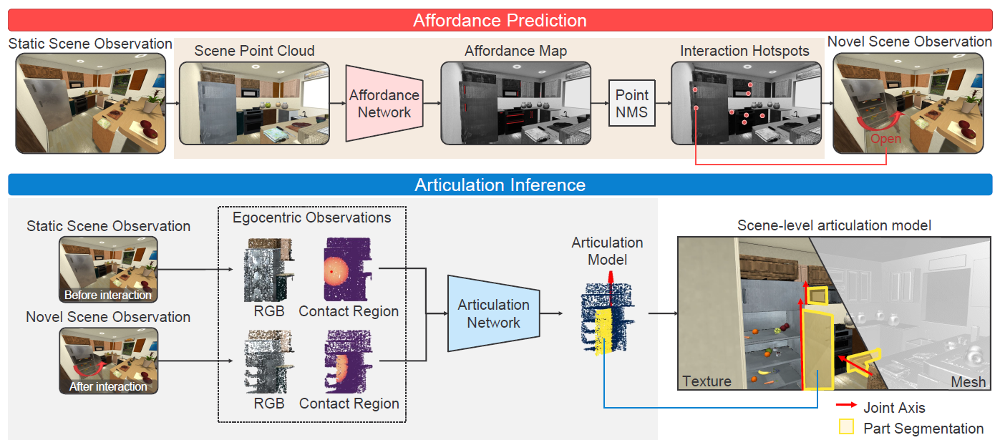
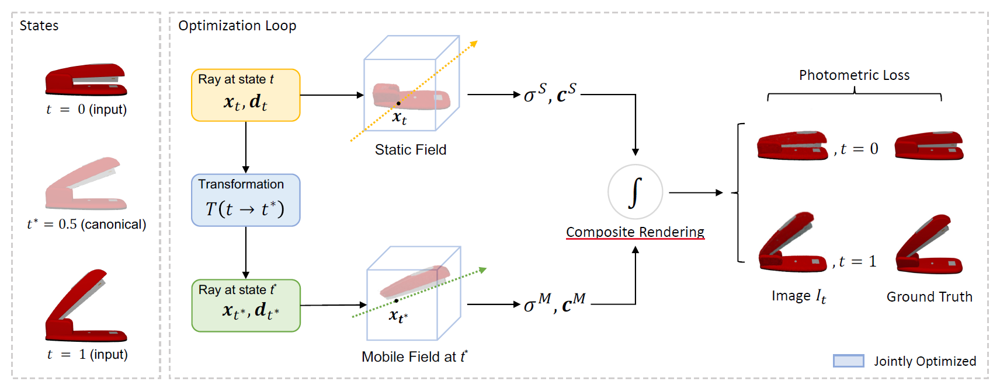
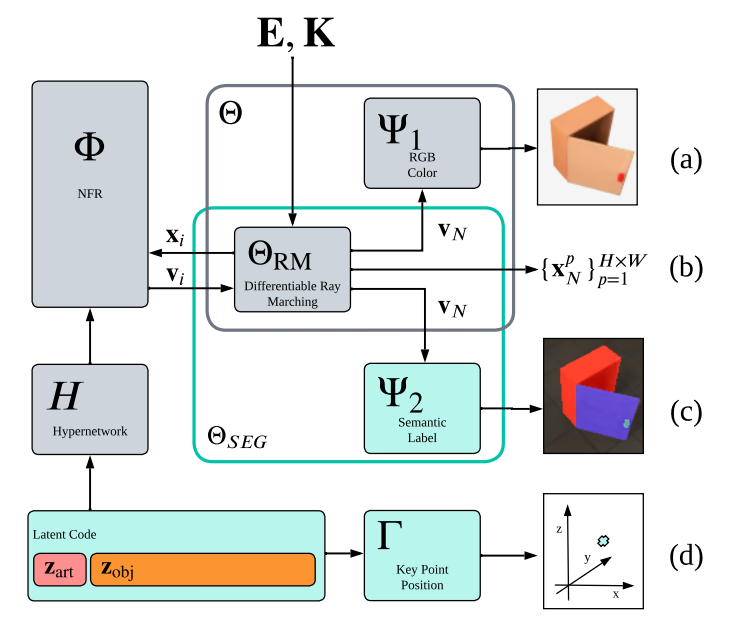
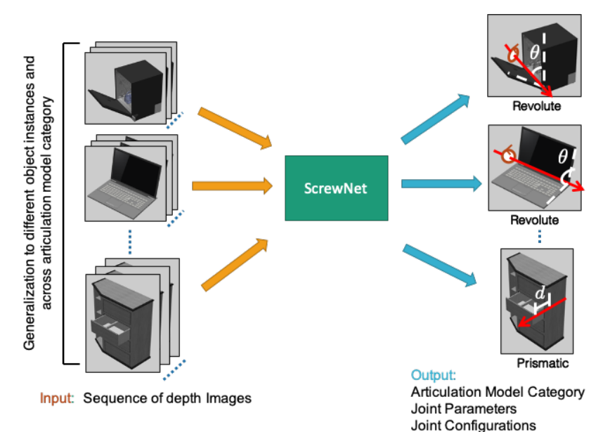

# Awesome-Articulation-Reconstruction-Works

This is a repo that collects some works about **articulated object reconstruction**. I will also write blog posts some works that contains outstanding approaches. Please post an issue if there are more papers or programs that you recommend. 

**Keywords:** Digital twins, Articulation reconstruction, part-level reconstruction

## Papers

[Ditto: Building digital twins of articulated objects from interaction](https://arxiv.org/abs/2202.08227). CVPR 2022.

- [[Github](https://github.com/UT-Austin-RPL/Ditto)] [[Project](https://ut-austin-rpl.github.io/Ditto/)]
- This paper propose a pre-trained model to reconstruct articulated physical objects. based on the point cloud of the object before and after interaction based on point segmentation. It can divide object into 1 static part 1 moving part, and a revolute or prismatic joint. However, it is limited in generalization to unseen object categories and it does not address detailed appearance reconstruction.

[Ditto in the house: Building articulation models of indoor scenes through interactive perception](https://arxiv.org/abs/2302.01295). ICRA 2023. 

- [[Github](https://github.com/UT-Austin-RPL/HouseDitto)] [[Project](https://ut-austin-rpl.github.io/HouseDitto/)]
- This paper proposed an approach to reconstruct articulated objects based on interactive perception. It takes observation as input and performs affordance prediction to choose an interaction point. Then by performing the interaction the articulation inference gets the observation before and after interaction, which are used to form the articulation model along with contact region. However there are no planning module for embodied AI in this paper, agents are teleported to the interaction point.

[PARIS: Part-level Reconstruction and Motion Analysis for Articulated Objects](https://arxiv.org/abs/2308.07391) ICCV 2023.

- [[Github]()] [[Project](https://3dlg-hcvc.github.io/paris/)] [[Video](https://www.youtube.com/watch?v=tDSrROPCgUc)]
- This paper introduces a self-supervised, end-to-end architecture that learns part-level implicit shape and appearance models and optimizes motion parameters jointly without requiring any 3D supervision, motion, or semantic annotation. The training process is similar to original NeRF but and extend the ray marching and volumetric rendering procedure to compose the two fields.

[Neural Field Representations of Articulated Objects for Robotic Manipulation Planning](https://arxiv.org/pdf/2309.07620.pdf)

- [Github] [[Project](https://phgrote.github.io/nfr)] [[Video](https://phgrote.github.io/nfr/#Video)]
- 

[ScrewNet: Category-Independent Articulation Model Estimation From Depth Images Using Screw Theory](https://arxiv.org/abs/2008.10518) ICRA 2021.

- [[Github](https://github.com/Pearl-UTexas/ScrewNet)] [[Project](https://pearl-utexas.github.io/ScrewNet/)]
- This paper proposed 
- Read more about it in [my blog]()

## TODO

Articulated Object Neural Radiance Field [[Github](https://github.com/zubair-irshad/articulated-object-nerf)]

[Reconstructing Part-Level 3D Models From a Single Image](https://ieeexplore.ieee.org/document/9102773)

[PARIS: Part-level Reconstruction and Motion Analysis for Articulated Objects](https://3dlg-hcvc.github.io/paris/)

Xiaoxia Huang, I. Walker and S. Birchfield, "[Occlusion-aware reconstruction and manipulation of 3D articulated objects](https://ieeexplore.ieee.org/document/6224911)," ICRA 2012.

[Shape2Motion: Joint Analysis of Motion Parts and Attributes from 3D Shapes](https://arxiv.org/pdf/1903.03911.pdf)

https://arxiv.org/pdf/2205.04382.pdf RSS 2022

https://arxiv.org/pdf/2307.16420

https://arxiv.org/abs/2104.07645

