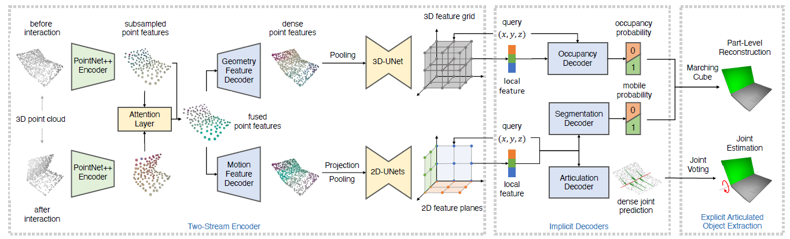

# Not-Awesome-Articulation-Reconstruction

This is a repo that collects some works about **articulation model reconstruction** and **interactive perception**. 

## Contents

## Papers

Jiang, Z., Hsu, C. C., & Zhu, Y. (2022). [Ditto: Building digital twins of articulated objects from interaction](https://arxiv.org/abs/2202.08227). In *Proceedings of the IEEE/CVF Conference on Computer Vision and Pattern Recognition* (pp. 5616-5626). 

- [[Github](https://github.com/UT-Austin-RPL/Ditto)]

- This paper uses a 

Hsu, C. C., Jiang, Z., & Zhu, Y. (2023). [Ditto in the house: Building articulation models of indoor scenes through interactive perception](https://arxiv.org/abs/2302.01295). *arXiv preprint arXiv:2302.01295*. []