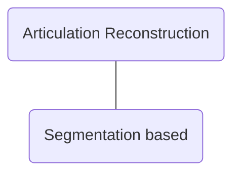

# Awesome-Articulation-Reconstruction-Works

This is a repo that collects some works about **articulated object reconstruction**.

**Keywords:** Digital twins, Articulation reconstruction, part-level reconstruction

Basic categories:

## Papers 

Jiang, Z., Hsu, C. C., & Zhu, Y. (2022). [Ditto: Building digital twins of articulated objects from interaction](https://arxiv.org/abs/2202.08227). CVPR 2022.

- [[Github](https://github.com/UT-Austin-RPL/Ditto)] [[Project](https://ut-austin-rpl.github.io/Ditto/)]
- This paper propose a pre-trained model to reconstruct articulated physical objects from unknown categories. based on the point cloud of the object before and after interaction based on point segmentation. It can divide object into 1 static part 1 moving part, and a revolute or prismatic joint. 

Hsu, C. C., Jiang, Z., & Zhu, Y. (2023). [Ditto in the house: Building articulation models of indoor scenes through interactive perception](https://arxiv.org/abs/2302.01295). ICRA 2023. 

- [Github (Not exist)] [[Project](https://ut-austin-rpl.github.io/HouseDitto/)]
- This paper proposed an approach to reconstruct articulated objects based on interactive perception. It takes observation as input and performs affordance prediction to choose an interaction point. Then by performing the interaction the articulation inference gets the observation before and after interaction, which are used to form the articulation model along with contact region. However there are no planning module for embodied AI in this paper, agents are teleported to the interaction point.

[PARIS: Part-level Reconstruction and Motion Analysis for Articulated Objects](https://arxiv.org/abs/2308.07391)

- [[Github]()] [[Project](https://3dlg-hcvc.github.io/paris/)] [[Video](https://www.youtube.com/watch?v=tDSrROPCgUc)]

## Projects

Articulated Object Neural Radiance Field [[Github](https://github.com/zubair-irshad/articulated-object-nerf)]

## TODO

[Reconstructing Part-Level 3D Models From a Single Image](https://ieeexplore.ieee.org/document/9102773)

[PARIS: Part-level Reconstruction and Motion Analysis for Articulated Objects](https://3dlg-hcvc.github.io/paris/)

Xiaoxia Huang, I. Walker and S. Birchfield, "[Occlusion-aware reconstruction and manipulation of 3D articulated objects](https://ieeexplore.ieee.org/document/6224911)," ICRA 2012.

[Shape2Motion: Joint Analysis of Motion Parts and Attributes from 3D Shapes](https://arxiv.org/pdf/1903.03911.pdf)

